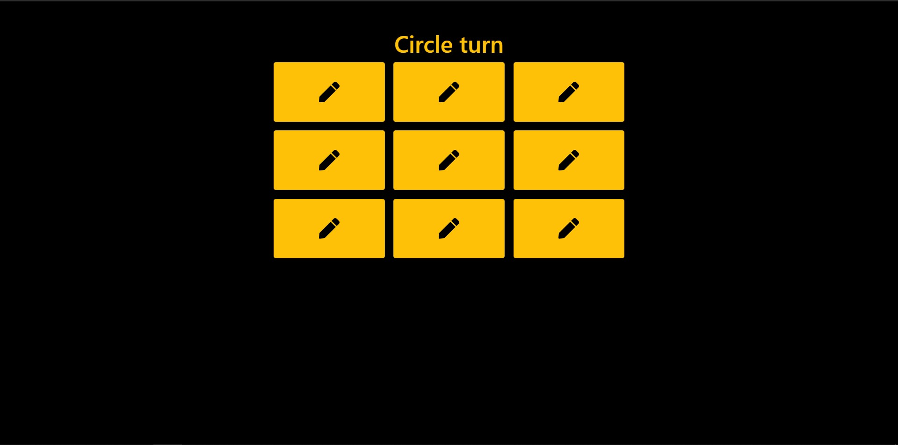
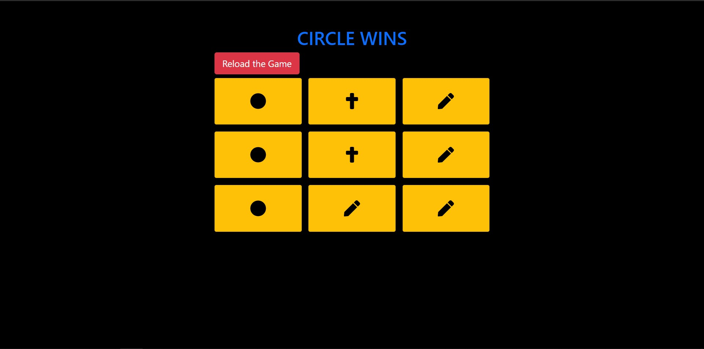

# Tic-Tac-Toe

This is a Simple Tic-Tac-Toe App developed using **ReactJS**.

## App Preview

- HomePage
  

- Winners Page
  

## Dependencies or Files used

1. ReactStrap

   - It is a bootstrap kinda module for react. **Link to package👉** [react-strap](https://www.npmjs.com/package/reactstrap)

2. ReactIcons

   - Icons package for react. **Link to package👉**[react-icons](https://www.npmjs.com/package/react-icons)

3. ReactToastify
   - Toaster for react to show toast messages for user. **Link to package👉**[react-toastify](https://www.npmjs.com/package/react-toastify)

## Note

- Main logic of the project is lies in `checkIsWinner()` method located in `App.js`.
