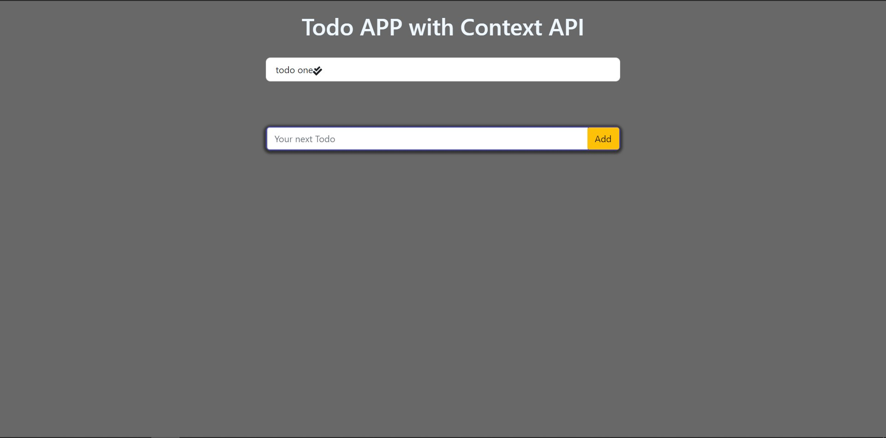

# Todo App

In this project, we used Context API with reducers and actions.

## Lessons

1. Actions
   - Actions are nothing but what are the operations done in the Application. In our App we make simple `Add`, `Remove` actions. In `/context/action.types.js` file we initialized them.
2. Reducers
   - Reducers are methods, which are used to determine what to do, when an action is performed. In `/context/reducer.js` file we determine the methods.

## App Images



## Dependencies

- Reactstrap
- Bootstrap
- React-Icons
- uuid

## Note

- we use our `TodoReducer` function developed in `/context/reducer.js`, by using `useReducer()` hook and by passing our reducer function as `useReducer(TodoReducer, [])`. we initialize it with empty `[]` so that the values will be stored in that.

```js
const [todos, dispatch] = useReducer(TodoReducer, []);
```

- By using the dispatch, we send data to the central store. so that any component in the app can access them.

- while dispatching we need to send the type of action and payload (data).

```js
dispatch({
  type: <Action.Type>,
  payload: data,
});
```
