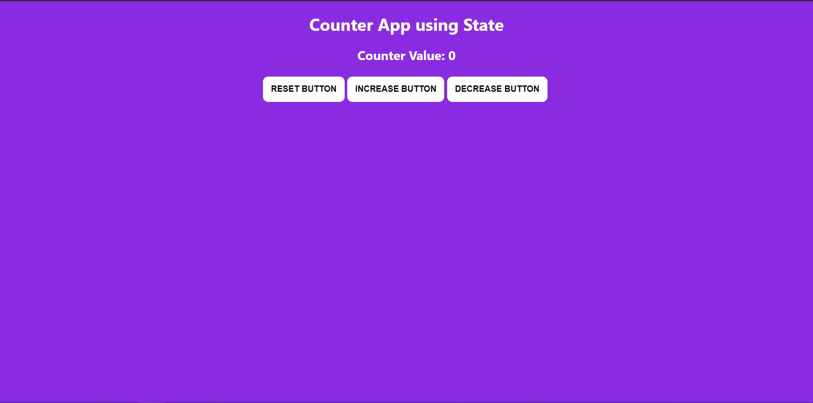

# Counter App

This is a Simple counter App. Developed using state.

## Images

- Home Page
  

## Notes:

- state is a centralised store for variables, so that changes made to the variables will be get updated all over the App.
- To use the state, first we have to import into the component.

```js
import { useState } from "react";
```

- Initialize the state

```js
const [counter, setCounter] = useState(0);
```

- First, we have to intialize the variable in the first part like `counter`.
- Second, we have to set the method to update the intialized variable like `setCounter`.
- we have to initialize the default value for the variable like `useState(<initialValue>)`. value should be of any type like _number_, _string_, _array_, _object_.
- The value should be updated using the method, which we initialized before `setCounter`.

```html
<button onClick={() => (count >= 10 ? "" : setCount(count + 1))}>
  Increase Button
</button>
```

- Here, `onClick()` is event, when the user clicks the button it will call the `setCount()` method with the updated value, `useState()` method uses this value to update the counter value.
